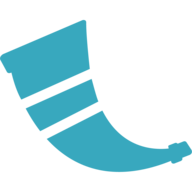

## Olá, Eu sou Cristian Di Giovanni 👋

<!-- :brazil: :it: :canada: -->
<!-- a maioria dos ícones estão nesse github: https://github.com/github/explore -->

### ⚡ Fatos sobre mim:
- Gosto de linguagens de programação (principalmente as funcionais)
- Amo Linux
- Tentando virar game dev 👍

### Linguagens e ferramentas que uso ou já usei

<!-- max 16 por linha -->

 
 

 

### Estou estudando

 

### Pretendo estudar

 
 

 
